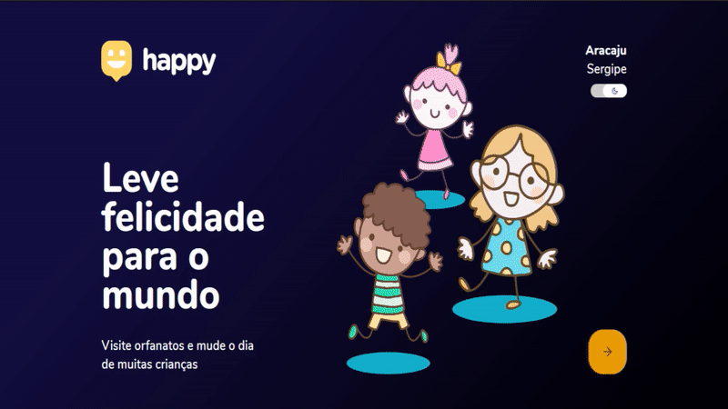

<h1 align="center">
    
     Next Level Week #3 
    Node.js | ReactJS | React Native
</h1>

  
  
   
   

  <a href="#bookmark-sobre">Sobre</a>&nbsp;&nbsp;&nbsp;|&nbsp;&nbsp;&nbsp;
  <a href="#rocket-tecnologias">Tecnologias</a>&nbsp;&nbsp;&nbsp;|&nbsp;&nbsp;&nbsp;
  <a href="#boom-como-executar">Como Executar</a>&nbsp;&nbsp;&nbsp;|&nbsp;&nbsp;&nbsp;
  <a href="#memo-licença">Licença</a>

## 📌 Index

- [Sobre o projeto](#-sobre-o-projeto)
- [Screenshots](#-screenshots)
- [Demo](#-demo)
- [Techs](#-techs)
- [Layout](#-layout)
- [Modificações](#-modificações)
- [Contribuições](#-contribuições)
- [License](#-license)

## ❔ Sobre o projeto

O Happy é uma aplicação que conecta pessoas à casas de acolhimento institucional para fazer o dia de muitas crianças mais feliz 💜

O projeto foi desenvolvido durante a Next Level Week 3 💜🚀

## 📸 Screenshots

## 📸 Demo 
Após modificações pessoais - Web
<h1 align="center">
    
 </h1>

## 🚀 Techs
Esse projeto foi desenvolvido com as seguintes tecnologias:

- [Node.js](https://nodejs.org/en/)
- [React](https://reactjs.org)
- [React Native](https://facebook.github.io/react-native/)
- [Expo](https://expo.io/)
- [TypeScript](https://www.typescriptlang.org/)

## 🔖 Layout

Nos links abaixo você encontra o layout do projeto web e também do mobile. Lembrando que você precisa ter uma conta no [Figma](http://figma.com/) para acessá-lo.

- [Layout Web](https://www.figma.com/file/mDEbnoojksG4w8sOxmudh3/Happy-Web)
- [Layout Mobile](https://www.figma.com/file/X27FfVxAgy9f5IFa7ONlph/Happy-Mobile)

## Modificações

1. Adicionado botão para Dark mode

2. Adicionada funcionalidade para contato via Whatsapp

## 🤝 Contribuições

Siga os passos abaixo para contribuir:

1. Faça o *fork* do projeto (<https://github.com/fsdavi/Happy-NLW3>)

2. Clone o seu *fork* para sua maquína (`git clone https://github.com/user_name/Happy-NLW3.git`)

3. Crie uma *branch* para realizar sua modificação (`git checkout -b feature/name_new_feature`)

4. Adicione suas modificações e faça o *commit* (`git commit -m "Descreva sua modificação"`)

5. *Push* (`git push origin feature/name_new_feature`)

6. Crie um novo *Pull Request*

7. Pronto, agora só aguardar a análise 🚀 

## 📜 License

O projeto está sobre a licença [MIT](./LICENSE) ❤️ 
